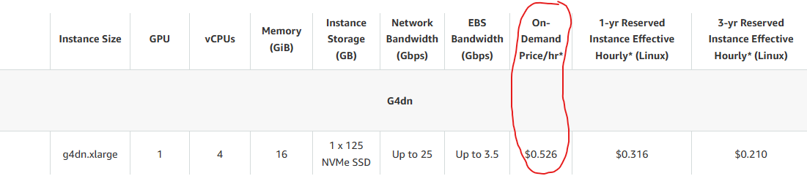
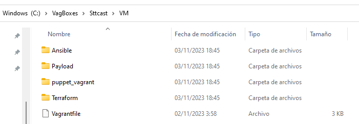
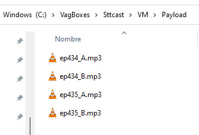
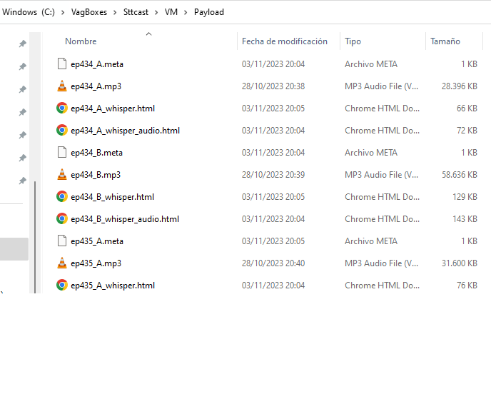
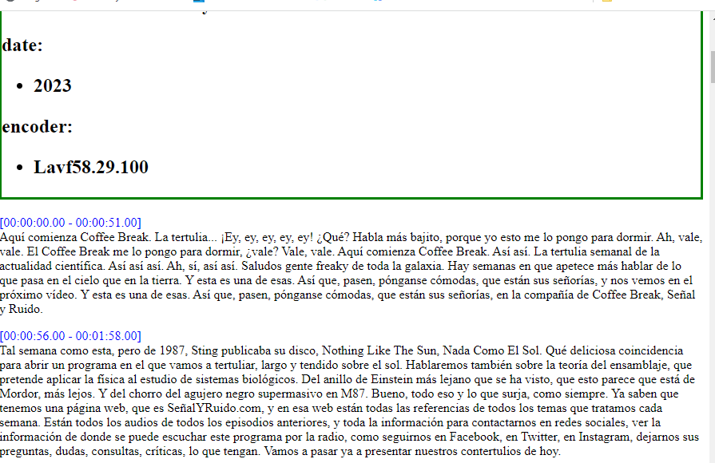
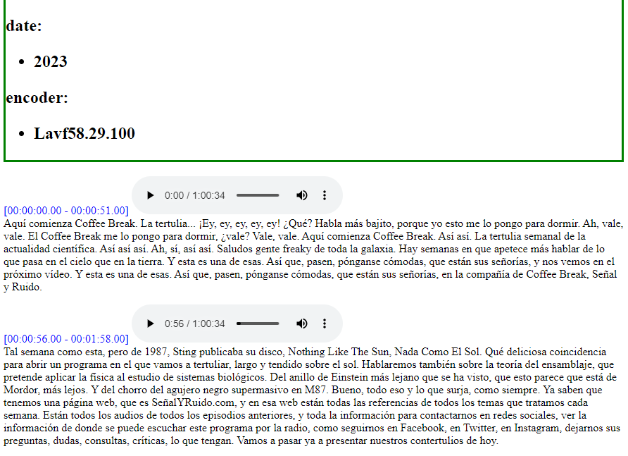

# Caution
The automation in sttcast uses an expensive machine from AWS, of type **g4dn.xlarge**, which has a usage price of about **$0.60/hour** (VAT included). This price is much less that the cost of the transcription service of AWS (similar, by the way, to that of other prividers as Azure, or Google) but can be very expensive if




**The user must be aware of these costs and must ensure that the resources used are destroyed at the completion of the process or if, for any reason, including a malfunction of the program (the developer makes does not warranty its proper functioning, the program is provided "AS IS"), the transcription time exceeds reasonable limits (in tests carried out, a 6-hour transcription takes 50 minutes).**

# Rationale for Automation

Alright, I know. Not everyone has a suitable environment for carrying out transcriptions with sttcast. Especially when we use the whisper engine. With whisper, only if one has a machine with GPU acceleration does the transcription time fall within reasonable limits. Graphics cards with GPUs are not cheap.

Nowadays, not having a suitable platform is not a huge problem. That's what cloud computing is for. Cloud service providers offer us, among other things, whatever platform we want. A machine with a T4 card is indeed affordable when it operates a few hours a month

However, acquiring cloud services, or rather, the specific service needed, is not a simple process for everyone. Choosing the zone, the machine, the security policies, provisioning the machine with the proper software, and running the programs is at the very least a slow and error-prone process, and it requires a certain level of knowledge that is not accessible to everyone.

This is where automation comes into play. The idea is to allow, with a minimum of commands (ideally a single button), to carry out the entire process.

Since automation requires specific tools, and these tools are not present on all systems, it is best to provide a virtual machine that has these tools available. This way, all users can work in a consistent environment. Here it is specified in software (IaC) a machine that can be created with a single command. The VM is specified with Vagrant and Puppet and it runs on VirtualBox, as they run most popular platforms (Linux, Windows, Mac).

These scripts make use of Amazon AWS services. It dpesn't seem very difficult, however, to adapt them to other cloud providers.

From the virtual machine, terraform and ansible will be used through a simple command that launches the following tasks:

* Creation of an AWS machine with GPU access.
* Configuration of the machine.
* Installation of the sttcast tool and all its dependencies.
* Uploading the files to be transcribed.
* Transcription.
* Downloading the transcriptions.


# Requirements

## HW

* Processor with 4 cores and 2.4 MHz of clock
* RAM: 8 GB
* HDD: free 10 GB.

## SW

* SO windows, Linux or IOS
* VirtualBox
* Vagrant

## AWS
You must have an account in Amazon AWS with valid credentials (***AWS_ACCESS_KEY_ID** and **AWS_SECRET_ACCESS_KEY**) to boot an EC2 instance with GPU (if your account does not allow you to boot that instance, you shoul open a ticket with Amazon)


# Instructions
## Copy the contents of Automation/VM

Copy the contents of Automation/VM to a directory. Vagrant does like short and simple names. The screenshot is taken from a Windows machine in which the branch **Automation/VM** has been installed in **C:\VagBoxes\Sttcast\VM**



## Copying the mp3 files to Payload dir

The mp3 files to transcript has to be copied in the Payload subdir as it is shown in the figure



## Creating the Virtual Machine

With a Windows console (cmd, PowerShell, Git bash, etc.), go to that directory and execute **vagrant up**. After a bunch of lines, vagrant will indicate that everything has gone well and will display the line **Notice: Applied catalog in x seconds** 

```console
C:\VagBoxes\Sttcast\VM>vagrant up
Bringing machine 'sttcast' up with 'virtualbox' provider...
==> sttcast: Importing base box 'bento/debian-12'...
==> sttcast: Matching MAC address for NAT networking...
==> sttcast: Checking if box 'bento/debian-12' version '202309.08.0' is up to date...
==> sttcast: Setting the name of the VM: VM_sttcast_1699034156616_84360
...

...
==> sttcast: Notice: /Stage[main]/Main/Apt::Source[terraform]/Apt::Setting[list-terraform]/File[/etc/apt/sources.list.d/terraform.list]/ensure: defined content as '{sha256}12e56579d63b0aea920f409b94d47435f834a2351cbef61cc11b8f554224d5c9'
==> sttcast: Notice: /Stage[main]/Apt::Update/Exec[apt_update]: Triggered 'refresh' from 1 event
==> sttcast: Notice: /Stage[main]/Main/Exec[install terraform]/returns: executed successfully
==> sttcast: Notice: Applied catalog in 195.46 seconds
```

## Entering the VM 

The VM is a Linux Debian 12 (stable distribution at the time of writing this document). To enter in it you should type **vagrant ssh**

```console
C:\VagBoxes\Sttcast\VM>vagrant ssh
Linux sttcast 6.1.0-11-amd64 #1 SMP PREEMPT_DYNAMIC Debian 6.1.38-4 (2023-08-08) x86_64

This system is built by the Bento project by Chef Software
More information can be found at https://github.com/chef/bento

The programs included with the Debian GNU/Linux system are free software;
the exact distribution terms for each program are described in the
individual files in /usr/share/doc/*/copyright.

Debian GNU/Linux comes with ABSOLUTELY NO WARRANTY, to the extent
permitted by applicable law.
vagrant@sttcast:~$
```

## Initializing terraform (only the firs time)

You must go to the **Terraform** dir and execute **terraform init** . This step is only necessary with a brand new machine created.
```bash
vagrant@sttcast:/vagrant/Terraform$ terraform init

Initializing the backend...

Initializing provider plugins...
- Reusing previous version of hashicorp/aws from the dependency lock file
- Using previously-installed hashicorp/aws v5.23.1

Terraform has been successfully initialized!

You may now begin working with Terraform. Try running "terraform plan" to see
any changes that are required for your infrastructure. All Terraform commands
should now work.

If you ever set or change modules or backend configuration for Terraform,
rerun this command to reinitialize your working directory. If you forget, other
commands will detect it and remind you to do so if necessary.
```

## Executing the job
From the directory /vagrant/Terraform, execute **terraform apply -auto--approve**. terraform will ask you for your AWS credentials (the program will not ask for them if you have previously configured the environment vars TF_VAR_AWS_ACCESS_KEY_ID and TF_VAR_AWS_SECRET_ACCESS_KEY)

```bash
vagrant@sttcast:/vagrant/Terraform$ terraform apply -auto-approve
var.AWS_ACCESS_KEY_ID
  Key ID for AWS

  Enter a value:

var.AWS_SECRET_ACCESS_KEY
  Secret Key for AWS

  Enter a value:


Terraform used the selected providers to generate the following execution plan. Resource actions are indicated with the
following symbols:
...

...

aws_instance.sttcast: Still creating... [37m21s elapsed]
aws_instance.sttcast: Still creating... [37m31s elapsed]
aws_instance.sttcast: Still creating... [37m41s elapsed]
aws_instance.sttcast: Still creating... [37m51s elapsed]
aws_instance.sttcast: Creation complete after 37m52s [id=i-0357318d0caa302d5]

Apply complete! Resources: 3 added, 0 changed, 0 destroyed.

Outputs:

public_ip = "X.X.X.X"
```

You should see in the Payload directory the results as shown in the image:



Filenames ended in whisper.html are the transcriptions in HTML format without player embedded. 



Filenames ended in whisper_audio.html are transcriptions in HTML format with player embedded



## Destroying the resources

This is a very important step, as the used machine is very expensive and you pay for it while it's alive. Remember the  **Caution note** at the beginning of this document. 

You have to destroy the resources with **terraform destroy -auto--aprove**

```bash
vagrant@sttcast:/vagrant/Terraform$ terraform destroy -auto-approve
var.AWS_ACCESS_KEY_ID
  Key ID for AWS

  Enter a value:

var.AWS_SECRET_ACCESS_KEY
  Secret Key for AWS

  Enter a value:

aws_key_pair.vm_keypair: Refreshing state... [id=sttcast_key_pair]
aws_security_group.sttcast: Refreshing state... [id=sg-0d7a598806daeb09e]
...

...
aws_security_group.sttcast: Destroying... [id=sg-0d7a598806daeb09e]
aws_key_pair.vm_keypair: Destroying... [id=sttcast_key_pair]
aws_key_pair.vm_keypair: Destruction complete after 0s
aws_security_group.sttcast: Destruction complete after 1s

Destroy complete! Resources: 3 destroyed.
```
In order to be sure it has worked, the command **terraform state** should not show anything

```bash
vagrant@sttcast:/vagrant/Terraform$ terraform state list
vagrant@sttcast:/vagrant/Terraform$
```


