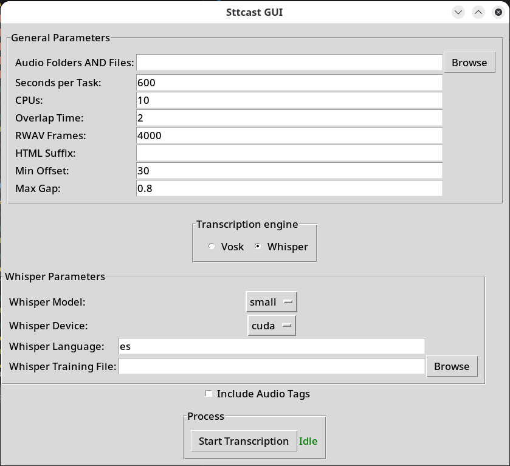
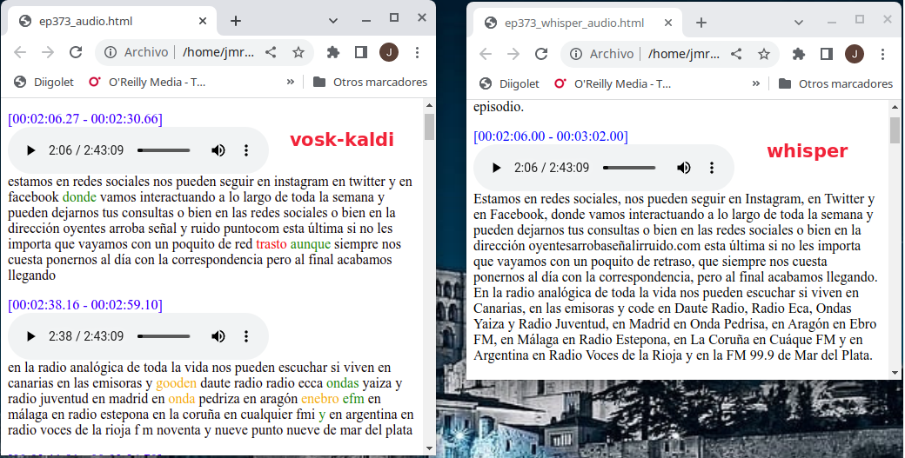

# Rationale for sttcast.py

STT (Speech To Text) technology is becoming increasyngly popular. Virtual assistants as Alexa, Siri, Cortana or Google are able to understand voice commands and operate accordingly.

Every big cloud provider has its APIs to transcribe voice to text. Results are usually good. However if you want (as I do) to convert collections of podcasts to text (hundreds of hours), you must consider time and cost of the operation.

There are open source projects as Vosk-Kaldi that may be of help in this task. **sttcast.py** makes use of its Python API to offline transcribe podcasts, downloaded as mp3 files.

It is worth also mentioning OpenAI Whisper. It is a very interesting alternative although it is also more resource  consuming. It has been included as an option engine for **sttcast.py**

# Requirements

The requirements for **sttcast.py** are as follows:

* A python 3.x installation (it has been tested on Python 3.10 on Windows and Linux)
* The tool **ffmpeg** installed in a folder of the PATH variable.
* A vosk model for the desired language (you may find a lot of them in [alfphacephei](https://alphacephei.com/vosk/models). It has been tested with the Spanish model [vosk-model-es-0.42](https://alphacephei.com/vosk/models/vosk-model-small-es-0.42.zip))
  
Python dependencies can be installed in a virtual environment. The dependencies are specified in the file `requirements.txt`. The following commands install, in Linux, such dependencies (I suppose they should also work in Mac):

```bash
python -m venv .venv
source .venv/bin/activate
pip install -r requirements.txt
```

In Windows, `python` could be `py` depending on the installation and the activation script is in `.venv\Scripts`

You can find [here](https://dev.to/shriekdj/how-to-create-and-activate-the-virtual-environment-for-python3-project-3g4l) detailed instructions to create and activate the virtual environment.

# How does sttcast.py work

As transcribing is a CPU intensive operation, **sttcast.py** makes use of multiprocessing in Python (you probably have known about GIL blues for multithreading or coroutines in Python). **sttcast.py** splits the entire work (the transcription of a podcast, perhaps of several hours) in fragments of s seconds (s is an optional paramenter, 600 seconds by default). 

If the task is to transcribe a large number of files (clearly exceeding the number of available CPUs), sttcast.py can utilize its capacity to transcribe multiple files in parallel without splitting them, thus eliminating potential issues at the split boundaries. In this case, it is advisable to set the number of seconds to a value greater than the size of the largest file (36000 seconds, or 10 hours, should be sufficient for almost all files).

**sttcast.py** converts the mp3 file to wav in order to use the vosk API. The main process pass the wav file as an argument to each one of the worker tasks, each proessing a fragment of audio (only part of the total frames of the wav file). The tasks are delivered to a pool of **c** processes (**c** is another optional paramenter, equal, by default, to the number of cpus of the system minus 2). In this way, the system may parallel **c** tasks.

Each fragment is transcribed in a different HTML file. Words of the trascribed text are highlighted with different colors to display the level of conficence of the transcription. The vosk-kaldi library delivers with each word, its confidence as a number from 0 to 1. **sttcast** supports 4 configurable levels of confidence:

* Very high confidence (text is shown in black)
* High confidence (text is shown in green)
* Medium confidence (text is shown in orange)
* Low confidence (text is shown in red)

Fragments of text are also tagged with time stamps to facilitate searching and listening from the mp3 file. If the --audio-tags option is selected, there is also an html5 audio player configured to listen to the file at the beginning of the segment.

The tool **add_audio_tag.py** adds audio controls to a transcribed html without the **--audio-tags**. It requires:

* BeautifulSoup
  ```bash
  pip install bs4
  ```
Once all fragments have been transcribed, the last step is the integration of all of them in an unique html file.

Metadata from mp3 is included in the title of the html

# Use of OpenAI whisper library

**sttcast** has an option (--whisper) to use the OpenAI whisper library instead of the vosk-kaldi one.

If you want to make transcription with whisper, you shoud take into account:

* Whisper is able to work with different models. You can see them with the --whmodel option
* With the --whisper option, you can take advantage of the CUDA acceleration (option --whdevice cuda) or not (--whdevice cpu). Without CUDA, whisper manages multiprocessing, so you will not notice any benefits configuring multiple cpus.
* Transcriptions are very slow without CUDA acceleration
* CUDA acceleration requires a good CUDA platform. 
* CUDA acceleation does benefit from multiple CPUS (option --cpu)

The following table, taken from [Whisper GitHub Repository](https://github.com/openai/whisper) shows the requirements for GPU memory of whisper models:

| Model | Reauired vRAM | Speed |
|---|---|---|
| tiny | ~1 GB | ~32x |
| base | ~1 GB | ~16x |
| small | ~2 GB | ¬6x |
| medium | ~5 GB | ~2x |
| large | ~10 GB | 1x |


# Use
## YouTube Tutorial

There is [a video in YouTube](https://www.youtube.com/watch?v=l7TtUFJio2g) where you can view general instructions about how to install and use the application

## CLI

**sttcast.py** is a Python module that runs with the help of a 3.x interpreter. 

It is has a very simple CLI interface that is autodocumented in the help (option **-h** or **--help**).

You should consider the location of model files and mp3 files in RAM drives to get more speed.

```bash
$ ./sttcast.py -h
$ ./sttcast.py -h
usage: sttcast.py [-h] [-m MODEL] [-s SECONDS] [-c CPUS] [-i HCONF] [-n MCONF] [-l LCONF] [-o OVERLAP]
                  [-r RWAVFRAMES] [-w] [--whmodel WHMODEL] [--whdevice {cuda,cpu}] [--whlanguage WHLANGUAGE]
                  [--whtraining WHTRAINING] [--whsusptime WHSUSPTIME] [-a] [--html-suffix HTML_SUFFIX]
                  [--min-offset MIN_OFFSET] [--max-gap MAX_GAP]
                  fnames [fnames ...]

positional arguments:
  fnames                archivos de audio o directorios a transcribir

options:
  -h, --help            show this help message and exit
  -m MODEL, --model MODEL
                        modelo a utilizar. Por defecto, /mnt/ram/es/vosk-model-es-0.42
  -s SECONDS, --seconds SECONDS
                        segundos de cada tarea. Por defecto, 600
  -c CPUS, --cpus CPUS  CPUs (tamaño del pool de procesos) a utilizar. Por defecto, 10
  -i HCONF, --hconf HCONF
                        umbral de confianza alta. Por defecto, 0.95
  -n MCONF, --mconf MCONF
                        umbral de confianza media. Por defecto, 0.7
  -l LCONF, --lconf LCONF
                        umbral de confianza baja. Por defecto, 0.5
  -o OVERLAP, --overlap OVERLAP
                        tiempo de solapamientro entre fragmentos. Por defecto, 2
  -r RWAVFRAMES, --rwavframes RWAVFRAMES
                        número de tramas en cada lectura del wav. Por defecto, 4000
  -w, --whisper         utilización de motor whisper
  --whmodel WHMODEL     modelo whisper a utilizar. Por defecto, small
  --whdevice {cuda,cpu}
                        aceleración a utilizar. Por defecto, cuda
  --whlanguage WHLANGUAGE
                        lenguaje a utilizar. Por defecto, es
  --whtraining WHTRAINING
                        nombre del fichero de entrenamiento. Por defecto, 'training.mp3'
  --whsusptime WHSUSPTIME
                        tiempo mínimo de intervención en el segmento. Por defecto, 60.0
  -a, --audio-tags      inclusión de audio tags
  --html-suffix HTML_SUFFIX
                        sufijo para el fichero HTML con el resultado. Por defecto '_result'
  --min-offset MIN_OFFSET
                        diferencia mínima entre inicios de marcas de tiempo. Por defecto 30
  --max-gap MAX_GAP     diferencia máxima entre el inicio de un segmento y el final del anterior. Por encima de
                        esta diferencia, se pone una nueva marca de tiempo . Por defecto 0.8


```

**add_audio_tag.py** 

```bash
$ ./add_audio_tag.py -h
usage: add_audio_tag.py [-h] [--mp3-file MP3_FILE] [-o OUTPUT] html_file

positional arguments:
  html_file             Fichero html para añadir audio tags

options:
  -h, --help            show this help message and exit
  --mp3-file MP3_FILE   Fichero mp3 al que se refieren los audio tags
  -o OUTPUT, --output OUTPUT
                        Fichero resultado tras añadir los audio tags

```


## GUI

From version v2.2.0, sttcast has also a GUI interface. It can be started with:

```bash
$ python ./sttcast-gui.py
```

With this interface, you can configure the arguments (the same arguments that the CLI supports) in a graphical manner.

The following snapshot is an snapshot of the interface:



# Automation

The whisper engine requires GPUs to avoid taking too much time. If you don't have a machine with GPU acceleration, or if you prefer not to have to install sttcasst in your environment, you can use the automation procedure explained in the ```Automation``` directory.

Automation creates an AWS EC2 machine in the Amazon Cloud, provisions it installing sttcast, upload the payload and download the results. And all with just two commands: one to create the resources in the cloud and perform the work, and another to destroy the resources.

Commands are executed in a VM also created with one command.

## Diarization

The **Whisper/Pyannote pipeline** is used to identify speakers in audio files. **Pyannote** is an AI-powered project hosted on **HuggingFace** that performs **speaker diarization**, clustering segments of speech by speaker identity. Since Pyannote performs **clustering** rather than **identification**, it does not inherently assign real names to speakers.

### HuggingFace Token Requirement
To use Pyannote, you need to obtain a **HuggingFace read access token**. This token should be stored in the **HUGGINGFACE_TOKEN** environment variable for authentication.

### Assigning Real Speaker Names
Because Pyannote clusters voices instead of identifying them explicitly, the program overcomes this limitation by appending **recognized voices** to the audio file before processing. This allows the system to **match unidentified segments to the closest known voice cluster** and assign a corresponding speaker label.

### Training Metadata Storage
The **trainingmp3.py** utility generates a **training MP3 file** containing known speaker samples. The **speaker identifiers** are stored as metadata in this training file.

### Speaker Identification Process
The complete process follows these steps:

1. **Generate identified audio samples**  
   - Extract speaker samples and prepare training segments.  

2. **Concatenate selected fragments into a single training MP3 file**  
   - Configuration is defined in the **training.yml** file.  
   - The **trainingmp3.py** module handles this task.  

3. **Run sttcast with the specified training file**  
   - The training MP3 file is used to improve speaker labeling.

### Output and Analysis
The generated **Whisper HTML files** label speech segments with speaker names and include final comments indicating the **total speaking time for each participant**.

The **speakingtime.py** utility extracts this speaker time data and stores it in a **CSV file**, which can be analyzed using the **Jupyter Notebook speakingtimes.ipynb**.

### Tools

**trainingmp3.py** is a Python module that generates a mp3 file with identified voices which is used to correctly perform diarization

```bash
$python trainingmp3.py -h
usage: trainingmp3.py [-h] [-c CONFIG] [-o OUTPUT] [-s SILENCE] [-t TIME]

Genera un archivo de entrenamiento a partir de audios etiquetados en un YAML.

options:
  -h, --help            show this help message and exit
  -c CONFIG, --config CONFIG
                        Archivo YAML con la lista de hablantes y sus archivos de audio (Predeterminado: training.yml).
  -o OUTPUT, --output OUTPUT
                        Nombre del archivo de salida (MP3). Predeterminado: training.mp3.
  -s SILENCE, --silence SILENCE
                        Duración del silencio entre hablantes en segundos. (Predeterminado: 5s)
  -t TIME, --time TIME  Duración total del fragmento en segundos. (Predeterminado: 600)
```

Example of configuration file:

```yaml
---
F01:
  name: Héctor Socas
  files:
    - Training/Coffee Break/Héctor Socas - 1.mp3
    - Training/Coffee Break/Héctor Socas - 2.mp3
F02:
  name: Héctor Vives
  files:
    - Training/Coffee Break/Héctor Vives - 1.mp3
    - Training/Coffee Break/Héctor Vives - 2.mp3
F03:
  name: Sara Robisco
  files:
    - Training/Coffee Break/Sara Robisco - 1.mp3
    - Training/Coffee Break/Sara Robisco - 2.mp3
F04:
  name: Francis Villatoro
  files:
    - Training/Coffee Break/Francis Villatoro - 1.mp3
F05: # Noisy environment
  name: Héctor Socas
  files:
    - Training/Coffee Break/Héctor Socas - 3.mp3
```


**speakingtime.py** is a Python module that extracts the total speaking times of speakers from the Whisper HTML files generated by sttcast and saves them into a CSV file.

```bash
$ python speakingtime.py -h
usage: speakingtime.py [-h] [-o OUTPUT] fnames [fnames ...]

positional arguments:
  fnames                Archivos con transcripciones de audio

options:
  -h, --help            show this help message and exit
  -o OUTPUT, --output OUTPUT
                        Nombre del archivo de salida
```


## To Do

Many modifications can be made and will be made in the future.

* In **sttcast**, the number of **CPUs** can be configured (in **Automation**, this is done with the ```app_exec role``` variables). Each file is divided into that number of pieces and assigned to a Python process. It would be much more intelligent to divide the work to be done (several MP3s) into subsets of similar sizes and start a sttcast process with each subset with the number of **CPUs** equal to 1. This way, time would be optimized, and potential boundary issues between pieces could be avoided. **(Done 2024-07-06)**
* Add a relevant searching system based in ElasticSearch and Kibana

# Screenshots




