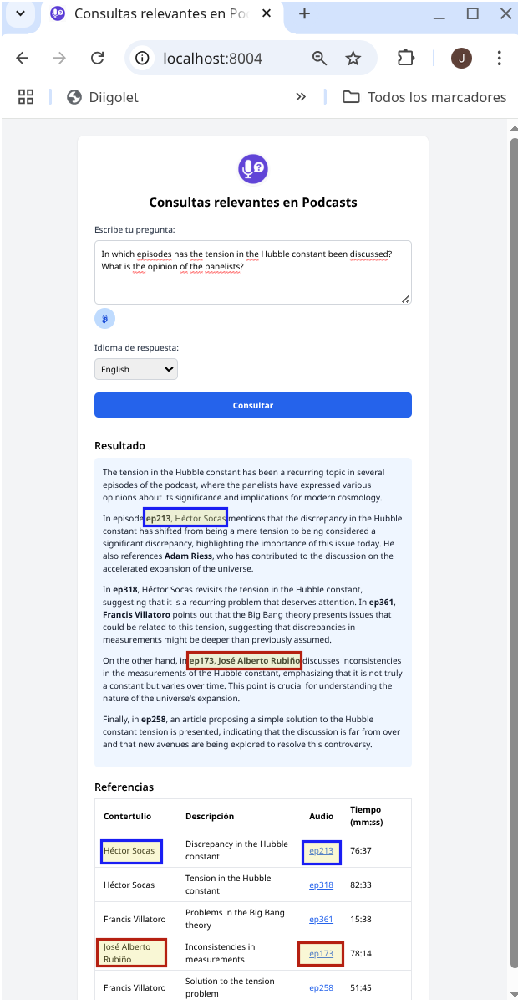
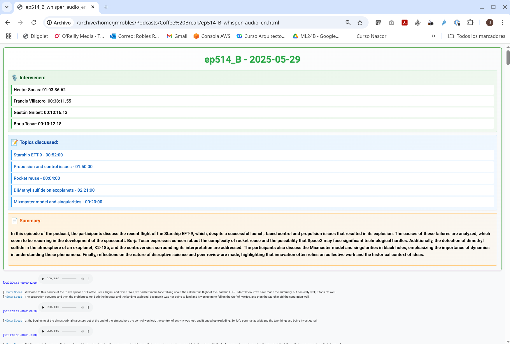

# STTCast - Intelligent Podcast Transcription and Search System

*Verba volant, scripta manent* — "spoken words fly away, written words remain." This ancient Latin proverb has perhaps been the greatest disadvantage of radio programs and their digital successors, podcasts. We can always revisit what was written, but not what was spoken — until now. This project breaks through this age-old barrier, enabling podcast enthusiasts who struggled to find where a particular topic was discussed to finally locate, read, and listen again to what was said.

**STTCast** is a comprehensive suite for automatic podcast transcription, speaker identification (diarization), and intelligent semantic search powered by RAG (Retrieval-Augmented Generation).

## 🎯 Key Features

- **WhisperX Transcription**: Primary transcription engine based on OpenAI Whisper with CUDA acceleration
- **Pyannote Diarization**: Automatic speaker identification through voice clustering
- **Alternative Vosk Engine**: For GPU-free processing (Spanish only)
- **Web Interface**: Browser-based transcription management
- **RAG Semantic Search**: Intelligent search system across podcast collections
- **Participation Analysis**: Speaking time statistics per speaker
- **Query Cache**: Semantic caching system to optimize repeated searches

## 📐 System Architecture

STTCast uses a three-tier architecture that separates responsibilities and enables scalability:

```
┌─────────────────────────────────────────────────────────────────────────┐
│                          PRESENTATION LAYER                             │
├─────────────────────────────────────────────────────────────────────────┤
│  ┌──────────────────┐  ┌──────────────────┐  ┌──────────────────────┐   │
│  │   Web Interface  │  │    RAG Client    │  │        CLI           │   │
│  │   (webif)        │  │  (rag/client)    │  │    (sttcast.py)      │   │
│  │   Port 8302      │  │   Port 8004      │  │                      │   │
│  └────────┬─────────┘  └────────┬─────────┘  └──────────────────────┘   │
│           │                     │                                       │
└───────────┼─────────────────────┼───────────────────────────────────────┘
            │                     │
┌───────────┼─────────────────────┼───────────────────────────────────────┐
│           │       SERVICE LAYER                                         │
├───────────┼─────────────────────┼───────────────────────────────────────┤
│  ┌────────▼─────────┐  ┌────────▼─────────┐  ┌──────────────────────┐   │
│  │  Transcription   │  │   RAG Server     │  │   Context Server     │   │
│  │     Server       │  │ (sttcast_rag_    │  │  (context_server)    │   │
│  │  (sttctranssrv)  │  │   service)       │  │                      │   │
│  │   Port 8000      │  │   Port 5500      │  │   Port 8001          │   │
│  └────────┬─────────┘  └────────┬─────────┘  └──────────┬───────────┘   │
│           │                     │                       │               │
└───────────┼─────────────────────┼───────────────────────┼───────────────┘
            │                     │                       │
┌───────────┼─────────────────────┼───────────────────────┼───────────────┐
│           │        DATA LAYER                           │               │
├───────────┼─────────────────────┼───────────────────────┼───────────────┤
│  ┌────────▼─────────┐  ┌────────▼─────────┐  ┌──────────▼───────────┐   │
│  │   PostgreSQL     │  │    OpenAI API    │  │   FAISS + SQLite     │   │
│  │   (webif_db)     │  │   (Embeddings)   │  │   (Vectors)          │   │
│  └──────────────────┘  └──────────────────┘  └──────────────────────┘   │
│                                                                         │
└─────────────────────────────────────────────────────────────────────────┘
```

### Main Components

#### 1. **Web Interface (webif)** - Port 8302
FastAPI web application that allows:
- Uploading audio files for transcription
- Configuring reusable transcription profiles
- Monitoring job progress
- Downloading results in HTML and SRT formats
- Managing users and permissions

#### 2. **Transcription Server (sttctranssrv)** - Port 8000
Backend that processes transcriptions:
- Job queue management
- WhisperX execution with Pyannote
- GPU resource control
- HTML and SRT file generation

#### 3. **RAG Server (sttcast_rag_service)** - Port 5500
Artificial intelligence service:
- Embedding generation with OpenAI
- Answering questions about content
- Automatic summary generation
- GPT model integration

#### 4. **Context Server (context_server)** - Port 8001
Database management:
- Relational database queries (SQLite)
- Vector searches with FAISS
- Context provision for RAG

#### 5. **RAG Web Client (rag/client)** - Port 8004
Flask web application for end users:
- Semantic search across transcriptions
- Speaker participation analysis
- Intelligent query caching
- Direct episode references

## 🔧 Requirements

### System
- Python 3.10 or higher
- FFmpeg installed in PATH
- NVIDIA GPU with CUDA (recommended for Whisper)
- PostgreSQL (for web interface)

### Python Dependencies
```bash
python -m venv .venv
source .venv/bin/activate
pip install -r requirements.txt
```

## 🚀 Transcription Engines

### WhisperX (Primary Engine)

WhisperX is the recommended engine for high-quality transcriptions. It combines:
- **OpenAI Whisper**: For speech-to-text transcription
- **Pyannote**: For diarization (speaker identification)

**Features:**
- CUDA acceleration for fast processing
- Multiple models based on quality/speed requirements
- Multi-language support
- Speaker identification with training file

| Model  | Required vRAM | Speed |
|--------|---------------|-------|
| tiny   | ~1 GB         | ~32x  |
| base   | ~1 GB         | ~16x  |
| small  | ~2 GB         | ~6x   |
| medium | ~5 GB         | ~2x   |
| large  | ~10 GB        | 1x    |

### Vosk (Alternative Engine)

Lightweight engine based on Vosk-Kaldi:
- Runs on CPU only
- Spanish language only
- Lower accuracy but no GPU requirements
- Useful for massive processing without GPU resources

Models available at [alphacephei](https://alphacephei.com/vosk/models). Recommended: [vosk-model-es-0.42](https://alphacephei.com/vosk/models/vosk-model-small-es-0.42.zip)

## 📹 Video Tutorial

A [YouTube tutorial](https://www.youtube.com/watch?v=l7TtUFJio2g) is available with installation and usage instructions. It covers an earlier version and will be updated soon.

## 📖 Usage

### Command Line Interface (CLI)

```bash
# Transcription with Whisper (recommended)
./sttcast.py -w --whlanguage es audio.mp3

# Transcription with Whisper and embedded audio tags
./sttcast.py -w -a --whlanguage es audio.mp3

# Transcription with training file for diarization
./sttcast.py -w --whtraining training.mp3 --whlanguage es audio.mp3

# Transcribe entire directory
./sttcast.py -w --whlanguage es /path/to/directory/

# Transcription with Vosk (Spanish only, no GPU)
./sttcast.py -m /path/to/vosk/model audio.mp3
```

### Complete CLI Options

```
usage: sttcast.py [-h] [-m MODEL] [-s SECONDS] [-c CPUS] [-i HCONF] [-n MCONF] 
                  [-l LCONF] [-o OVERLAP] [-r RWAVFRAMES] [-w] [--whmodel WHMODEL] 
                  [--whdevice {cuda,cpu}] [--whlanguage WHLANGUAGE] 
                  [--whtraining WHTRAINING] [--whsusptime WHSUSPTIME] [-a] 
                  [--html-suffix HTML_SUFFIX] [--min-offset MIN_OFFSET] 
                  [--max-gap MAX_GAP] [-p PREFIX] [--calendar CALENDAR] 
                  [-t TEMPLATES] [--pyannote-method PYANNOTE_METHOD] 
                  [--pyannote-min-cluster-size SIZE] [--pyannote-threshold THRESHOLD]
                  [--pyannote-min-speakers N] [--pyannote-max-speakers N]
                  fnames [fnames ...]

Positional arguments:
  fnames                Audio files or directories to transcribe

General options:
  -h, --help            Show help
  -s SECONDS            Seconds per task (default: 600)
  -c CPUS               CPUs to use (default: cores - 2)
  -a, --audio-tags      Include audio player in HTML
  --html-suffix SUFFIX  Suffix for HTML file (default: empty)
  -p PREFIX             Prefix for output files (default: ep)
  --calendar FILE       CSV file with episode calendar (default: calfile)
  -t TEMPLATES          HTML templates directory (default: templates)

Vosk options:
  -m MODEL              Path to Vosk model
  -i HCONF              High confidence threshold (default: 0.95)
  -n MCONF              Medium confidence threshold (default: 0.7)
  -l LCONF              Low confidence threshold (default: 0.5)
  -o OVERLAP            Overlap between fragments (default: 2)
  -r RWAVFRAMES         WAV read frames (default: 4000)

Whisper options:
  -w, --whisper         Use Whisper engine (recommended)
  --whmodel MODEL       Model: tiny|base|small|medium|large (default: small)
  --whdevice DEVICE     Acceleration: cuda|cpu (default: cuda)
  --whlanguage LANG     Language: es|en|fr|de... (default: es)
  --whtraining FILE     Training MP3 file for diarization (default: training.mp3)
  --whsusptime SECS     Minimum speaking time (default: 60.0)

Pyannote options (advanced diarization):
  --pyannote-method     Clustering method (default: ward)
  --pyannote-min-cluster-size  Minimum cluster size (default: 15)
  --pyannote-threshold  Clustering threshold (default: 0.7147)
  --pyannote-min-speakers  Expected minimum number of speakers
  --pyannote-max-speakers  Expected maximum number of speakers
```

### Web Interface

The web interface allows managing transcriptions from the browser:

```bash
# Start transcription server
python -m sttctranssrv

# Start web interface
python -m webif.webif --port 8302
```


## ⚙️ Environment Variables Configuration

Environment variables are stored in files within the `.env/` directory:

### `.env/db.env` - SQLite Database (fragments and embeddings)
```bash
STTCAST_DB_FILE="/path/to/your/database.db"
```

### `.env/faiss.env` - FAISS Vector Database
```bash
STTCAST_FAISS_FILE="/path/to/your/index.faiss"
STTCAST_RELEVANT_FRAGMENTS=100
```

### `.env/openai.env` - OpenAI API
```bash
OPENAI_API_KEY="sk-..."
OPENAI_GPT_MODEL="gpt-4o-mini"
OPENAI_EMBEDDINGS_MODEL="text-embedding-3-small"
```

### `.env/podcast.env` - Podcast Collection Configuration
```bash
PODCAST_CAL_FILE="/path/to/calendar.csv"
PODCAST_PREFIX="ep"
PODCAST_WORKDIR="/path/to/podcasts/"
PODCAST_TEMPLATES="/path/to/templates/"
```

### `.env/huggingface.conf` - HuggingFace Token (for Pyannote)
```bash
HUGGINGFACE_TOKEN="hf_..."
```

### `.env/pyannote.env` - Pyannote Diarization Settings
```bash
PYANNOTE_METHOD=ward
PYANNOTE_MIN_CLUSTER_SIZE=15
PYANNOTE_THRESHOLD=0.7147
# PYANNOTE_MIN_SPEAKERS=2
# PYANNOTE_MAX_SPEAKERS=5
```

### `.env/rag_server.env` - RAG Server
```bash
RAG_SERVER_HOST="0.0.0.0"
RAG_SERVER_PORT=5500
```

### `.env/rag_client.env` - RAG Web Client
```bash
RAG_CLIENT_HOST="0.0.0.0"
RAG_CLIENT_PORT=8004
RAG_CLIENT_STT_LANG="es-ES"
RAG_MP3_DIR="/path/to/mp3/files"
```

### `.env/webif.env` - Web Interface
```bash
# Server
WEBIF_HOST=127.0.0.1
WEBIF_PORT=8302
WEBIF_DEBUG=false

# Initial admin user
WEBIF_ADMIN_NAME=admin
WEBIF_ADMIN_PASSWORD=secure_password
WEBIF_ADMIN_EMAIL=admin@example.com

# PostgreSQL database
WEBIF_DB_HOST=localhost
WEBIF_DB_PORT=5432
WEBIF_DB_USER=sttcast
WEBIF_DB_PASSWORD=db_password
WEBIF_DB_NAME=sttcast_webif

# Session
WEBIF_SECRET_KEY=random-secret-key
WEBIF_SESSION_EXPIRE=480

# File storage
WEBIF_UPLOAD_DIR=/tmp/sttcast_webif/uploads
WEBIF_RESULTS_DIR=/tmp/sttcast_webif/results
WEBIF_TRAINING_DIR=/tmp/sttcast_webif/training
WEBIF_MAX_UPLOAD_SIZE=524288000
```

### `.env/transsrv.env` - Transcription Server
```bash
TRANSSRV_HOST=0.0.0.0
TRANSSRV_PORT=8000
TRANSSRV_API_KEY=secure-hmac-key
```


## 🎤 Diarization (Speaker Identification)

The **Whisper/Pyannote pipeline** automatically identifies speakers. Pyannote performs voice segment clustering but does not identify real names.

### HuggingFace Token
Pyannote requires a **HuggingFace** read access token. Store it in the `HUGGINGFACE_TOKEN` environment variable.

### Speaker Identification Process

Since Pyannote clusters voices instead of identifying them, the program overcomes this limitation by adding **recognized voices** to the audio before processing. This allows the system to match unidentified segments with the closest known voice cluster.

#### 1. Create training configuration file

```yaml
# training.yml
F01:
  name: John Smith
  files:
    - Training/John_1.mp3
    - Training/John_2.mp3
F02:
  name: Jane Doe
  files:
    - Training/Jane_1.mp3
    - Training/Jane_2.mp3
```

#### 2. Create training MP3 file

```bash
python diarization/trainingmp3.py -c training.yml -o training.mp3
```

Options:
```
-c CONFIG   YAML file with speakers (default: training.yml)
-o OUTPUT   Output MP3 file (default: training.mp3)
-s SILENCE  Silence between speakers in seconds (default: 5)
-t TIME     Total fragment duration in seconds (default: 600)
```

#### 3. Transcribe with diarization

```bash
./sttcast.py -w --whtraining training.mp3 --whlanguage es podcast.mp3
```

### Speaking Time Analysis

Generated HTML files include final comments with the total speaking time for each participant.

Extract statistics to CSV:
```bash
python diarization/speakingtime.py -o times.csv transcriptions/*.html
```

Analyze with the `notebooks/speakingtimes.ipynb` notebook.

## 🔍 RAG Semantic Search System

The RAG system enables semantic searches across transcribed podcast collections.

### RAG System Architecture

Transcription segments are stored in:
- **Relational database (SQLite)**: For structured management and conventional queries
- **Vector database (FAISS)**: For efficient semantic searches using embeddings

#### sttcast_rag_service (Port 5500)
FastAPI service that provides:
- Embedding generation from transcription fragments
- Automatic content question answering
- Combination of vector retrieval and natural language generation
- Automatic episode summary generation

#### context_server (Port 8001)
Service that queries both databases to provide context:
- Relational database queries
- Vector searches with FAISS
- Relevant fragment provision for RAG

#### RAG Web Client (Port 8004)
Flask web application that provides:
- **Semantic search**: Natural language questions about content
- **Participation analysis**: Speaking times per speaker
- **Query cache**: Semantic caching system storing previous queries
- **Direct references**: Links to episodes and specific timestamps

### Starting the RAG System

```bash
# Start context server
python db/context_server.py  # Port 8001

# Start RAG service
python rag/sttcast_rag_service.py  # Port 5500

# Start RAG web client
cd rag/client && python client_rag.py  # Port 8004
```

Access at `http://localhost:8004`

## 📝 Summary Generation

The system generates automatic episode summaries using GPT:

### 1. Get summaries

```bash
python summaries/get_rag_summaries.py -i /path/to/transcriptions -o /path/to/summaries
```

The service processes `*_whisper_audio_es.html` files in configurable blocks.

### 2. Insert summaries into HTMLs

```bash
python summaries/insert_summaries.py -s /path/to/summaries -t /path/to/transcriptions
```

Summaries are inserted into all HTML files for the episode (different engines, languages, etc.).


## 🛠️ Additional Tools

### add_audio_tag.py
Adds audio controls to an HTML transcribed without the `--audio-tags` option:

```bash
./add_audio_tag.py --mp3-file audio.mp3 -o output.html transcription.html
```

## ☁️ Cloud Automation

If you don't have a local GPU, the `Automation/` directory contains scripts to:
- Create AWS EC2 machines with GPU
- Automatically provision and install STTCast
- Process files and download results
- Destroy resources when finished

All with just two commands: one to create and process, another to destroy.

## 🖼️ Screenshots

### Transcription with Summary


### Transcription with Diarization


### Speakers Analysis


### RAG Client with Web Interface


## 📄 License

This project is licensed under the terms specified in the [LICENSE](LICENSE) file.

---

**STTCast** - Intelligent podcast transcription with AI